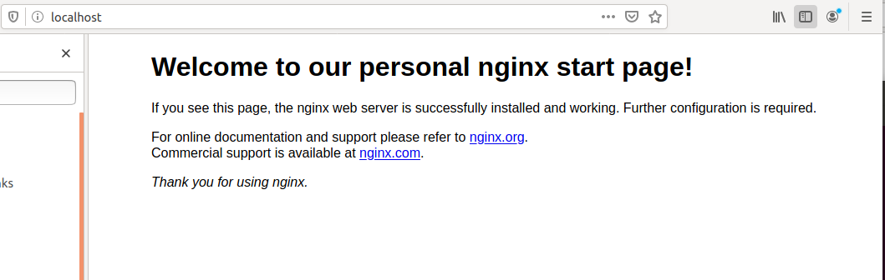

# Docker, docker-compose, dockerfile

## Создайте свой кастомный образ nginx на базе alpine  
1. Создаем Dockerfile для сборки образа следующего содержания:  
	```
	user@linux1:~/linux/homework-09$ cat Dockerfile
	
	FROM alpine:latest
	LABEL maintainer="Aleksey Sboev <sboevav@mail.ru>"

	RUN apk update \
	    && apk upgrade \
	    && apk add nginx \
	    && mkdir -p /run/nginx

	COPY nginx.conf /etc/nginx/conf.d/default.conf 
	COPY index.html /usr/share/nginx/html/index.html

	EXPOSE 80

	CMD ["nginx", "-g", "daemon off;"]
	```
2. Создаем файл nginx.conf с дополнительной конфигурацией nginx следующего содержания:  
	```
	user@linux1:~/linux/homework-09$ cat nginx.conf 

	server {
	  listen       80;
	  server_name  localhost;
	  root   /usr/share/nginx/html;
	  index  index.html index.htm;

	  location / {
	    try_files $uri /index.html;
	  }
	}
	```
3. Берем дефолтную страницу nginx, которую будем выдавать из нашего контейнера и слегка изменяем ее ширину и заголовок на следующее содержание:  
	```
	user@linux1:~/linux/homework-09$ cat index.html
	<!DOCTYPE html>
	<html>
	<head>
	<title>Welcome to our personal nginx start page!</title> <--- Изменено
	<style>
	    body {
		width: 50em; <--- Изменено
		margin: 0 auto;
		font-family: Tahoma, Verdana, Arial, sans-serif;
	    }
	</style>
	</head>
	<body>
	<h1>Welcome to our personal nginx start page!</h1> <--- Изменено
	<p>If you see this page, the nginx web server is successfully installed and
	working. Further configuration is required.</p>

	<p>For online documentation and support please refer to
	<a href="http://nginx.org/">nginx.org</a>.<br/>
	Commercial support is available at
	<a href="http://nginx.com/">nginx.com</a>.</p>

	<p><em>Thank you for using nginx.</em></p>
	</body>
	</html>
	```
4. Установим необходимый инструментарий  
	```
	sudo apt  install docker.io
	```
5. Переключаемся на суперпользователя и приступаем к сборке образа nginx:alpine  
	```
	user@linux1:~/linux/homework-09$ sudo su
	[sudo] password for user: 
	root@linux1:/home/user/linux/homework-09# docker build -t nginx:alpine .

	Sending build context to Docker daemon  112.6kB
	Step 1/7 : FROM alpine:latest
	latest: Pulling from library/alpine
	c9b1b535fdd9: Already exists 
	Digest: sha256:ab00606a42621fb68f2ed6ad3c88be54397f981a7b70a79db3d1172b11c4367d
	Status: Downloaded newer image for alpine:latest
	 ---> e7d92cdc71fe
	Step 2/7 : LABEL maintainer="Aleksey Sboev <sboevav@mail.ru>"
	 ---> Running in 61a0bfceefc7
	Removing intermediate container 61a0bfceefc7
	 ---> 606fa35a0a42
	Step 3/7 : RUN apk update     && apk upgrade     && apk add nginx     && mkdir -p /run/nginx
	 ---> Running in b90a53c82ad6
	fetch http://dl-cdn.alpinelinux.org/alpine/v3.11/main/x86_64/APKINDEX.tar.gz
	fetch http://dl-cdn.alpinelinux.org/alpine/v3.11/community/x86_64/APKINDEX.tar.gz
	v3.11.3-73-g095aa9b9d4 [http://dl-cdn.alpinelinux.org/alpine/v3.11/main]
	v3.11.3-72-g77ec45c4dc [http://dl-cdn.alpinelinux.org/alpine/v3.11/community]
	OK: 11262 distinct packages available
	(1/1) Upgrading ca-certificates-cacert (20191127-r0 -> 20191127-r1)
	OK: 6 MiB in 14 packages
	(1/2) Installing pcre (8.43-r0)
	(2/2) Installing nginx (1.16.1-r6)
	Executing nginx-1.16.1-r6.pre-install
	Executing busybox-1.31.1-r9.trigger
	OK: 7 MiB in 16 packages
	Removing intermediate container b90a53c82ad6
	 ---> 73066d4c5d3b
	Step 4/7 : COPY nginx.conf /etc/nginx/conf.d/default.conf
	 ---> 03516ab1f16f
	Step 5/7 : COPY index.html /usr/share/nginx/html/index.html
	 ---> 858bb62147ec
	Step 6/7 : EXPOSE 80
	 ---> Running in 3ee3002d1157
	Removing intermediate container 3ee3002d1157
	 ---> 1c95d55aecff
	Step 7/7 : CMD ["nginx", "-g", "daemon off;"]
	 ---> Running in 7f0ff02f7ef2
	Removing intermediate container 7f0ff02f7ef2
	 ---> 95d48724bf17
	Successfully built 95d48724bf17
	Successfully tagged nginx:alpine
	```
6. Проверяем, что получили после сборки  
	```
	root@linux1:/home/user/linux/homework-09# docker images -a

	REPOSITORY          TAG                 IMAGE ID            CREATED             SIZE
	nginx               alpine              95d48724bf17        14 minutes ago      8.81MB
	<none>              <none>              1c95d55aecff        14 minutes ago      8.81MB
	<none>              <none>              73066d4c5d3b        14 minutes ago      8.81MB
	<none>              <none>              03516ab1f16f        14 minutes ago      8.81MB
	<none>              <none>              858bb62147ec        14 minutes ago      8.81MB
	<none>              <none>              606fa35a0a42        14 minutes ago      5.59MB
	alpine              latest              e7d92cdc71fe        4 weeks ago         5.59MB
	```
6. Запускаем контейнер с указанием проброса 80-го порта и проверяем, что контейнер запущен  
	```
	root@linux1:/home/user/linux/homework-09# docker run -d -p 80:80 nginx:alpine
	82181139f0fdf0c0ee5e8e0bcb8f47634096115d8dca190d3d1a67af90317a5e
	root@linux1:/home/user/linux/homework-09# docker ps
	CONTAINER ID        IMAGE               COMMAND                  CREATED              STATUS              PORTS                NAMES
	82181139f0fd        nginx:alpine        "nginx -g 'daemon of…"   About a minute ago   Up About a minute   0.0.0.0:80->80/tcp   nifty_wing

7. Обращаемся браузером к localhost, видим нашу измененную страницу приветствия



## Определите разницу между контейнером и образом  
Делаю попытку объяснения, собрав воедино некоторые термины из гугля и добавив свои мысли :)  

Текстовым представлением докеровского образа является Dockerfile. При команде docker build этот файл считывается, каждая строка-команда запускает новый контейнер, а ее результат коммитится в новый слой/имейдж. Результатом работы докера по данной команде как раз и является образ.  

Образ - это собранный двоичный пакет (хранящийся в системе или выложенный в репозиторий), включающий в себя определенные программы и зависимости, необходимые для запуска этих программ. Что касается структуры - образ состоит из целой пачки более мелких образов, называемых также слоями, каждый из которых содержит файлы, команды, результат их выполнения и другую мета-информацию.   

Контейнер - это запущенный в системе образ. Во время запуска драйвер overlay собирает все слои образа в заданном порядке и контейнер выглядит как единая цельная система. Помимо этого, при старте контейнера поверх всего образа создается новый слой/имейдж. При удалении контейнера по сути только этот слой и удаляется со всеми изменениями произошедшими во время жизни контейнера, однако их можно “закоммитить” создав новый образ.  

## Ответьте на вопрос: Можно ли в контейнере собрать ядро?  
Насколько я понимаю, то можно в образ поместить другое ядро, если без этого неикак не будет работать необходимая нам программа, но делать это не очень рекомендуется, т.к. требуются дополнительные ресурсы.  
"Контейнеры могут использовать разные ядра, но ядро ​​ОС хоста является общим, когда это возможно. Для запуска другого ядра вам необходимо использовать виртуализацию. Это редко и используется только при необходимости из-за ухудшения производительности."  
https://ubuntugeeks.com/questions/364651/docker-containers-have-their-own-kernel-or-not  


## Создайте кастомные образы nginx и php, объедините их в docker-compose  

