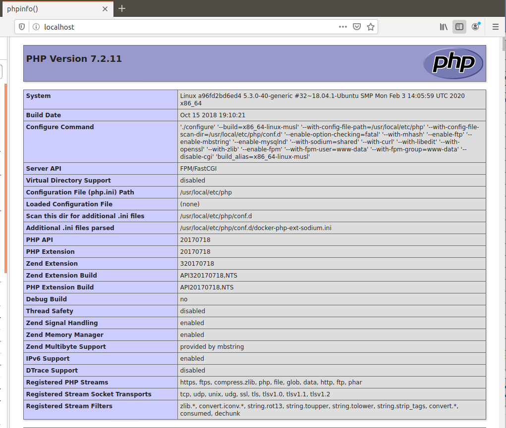

# Docker, docker-compose, dockerfile

## Основное ДЗ: создайте свой кастомный образ nginx на базе alpine  

Во время выполнения ДЗ пришлось познакомиться с легковесной версией дистрибутива линукс - alpine. Оказалось, что имеются отличия в администрировании, с которыми пришлось разбираться. Ради интереса развернул вагрантом виртуалку alpine и поковырялся в ней. Сама виртуалка заняла всего 260 МБ. При сборке образа и запуске контейнера также пришлось разбираться как это все функционирует, какими командами управляется, бороться с разными ошибками типа: почему не собирается контейнер, почему при запуске контейнер сразу останавливается или почему nginx не выдает стартовую страницу. При разборе ошибок научился подключаться к контейнеру, вносить изменения, и т.п.  
Также при поиске информации находил разные варианты реализации подобной задачи. Одно из решений понравилось - файл Dockerfile-original заводится с пол-оборота, нормально собирается образ и запускается контейнер. При этом он добавляет группу и пользователя nginx, устанавливает nginx либо из готовых пакетов, либо собирает пакеты из исходников, если мы основаны на конфигурации, для которой пакеты еще не построены, а также перенаправляет логи ошибок и запросов.  
Несмотря на это решение хотелось самому создать минимальный работающий образ. Работа с докером осуществляется с повышенными правами, поэтому почти все команды выполнены из под рута. Результат работы представлен ниже.

1. Создаем Dockerfile для сборки образа следующего содержания:  
	```
	user@linux1:~/linux/homework-09$ cat Dockerfile
	
	FROM alpine:latest
	LABEL maintainer="Aleksey Sboev <sboevav@mail.ru>"

	RUN apk update \
	    && apk upgrade \
	    && apk add nginx \
	    && mkdir -p /run/nginx

	COPY nginx.conf /etc/nginx/conf.d/default.conf 
	COPY index.html /usr/share/nginx/html/index.html

	EXPOSE 80

	CMD ["nginx", "-g", "daemon off;"]
	```
2. Создаем файл nginx.conf с дополнительной конфигурацией nginx следующего содержания:  
	```
	user@linux1:~/linux/homework-09$ cat nginx.conf 

	server {
	  listen       80;
	  server_name  localhost;
	  root   /usr/share/nginx/html;
	  index  index.html index.htm;

	  location / {
	    try_files $uri /index.html;
	  }
	}
	```
3. Берем дефолтную страницу nginx, которую будем выдавать из нашего контейнера и слегка изменяем ее ширину и заголовок на следующее содержание:  
	```
	user@linux1:~/linux/homework-09$ cat index.html
	<!DOCTYPE html>
	<html>
	<head>
	<title>Welcome to our personal nginx start page!</title> <--- Изменено
	<style>
	    body {
		width: 50em; <--- Изменено
		margin: 0 auto;
		font-family: Tahoma, Verdana, Arial, sans-serif;
	    }
	</style>
	</head>
	<body>
	<h1>Welcome to our personal nginx start page!</h1> <--- Изменено
	<p>If you see this page, the nginx web server is successfully installed and
	working. Further configuration is required.</p>

	<p>For online documentation and support please refer to
	<a href="http://nginx.org/">nginx.org</a>.<br/>
	Commercial support is available at
	<a href="http://nginx.com/">nginx.com</a>.</p>

	<p><em>Thank you for using nginx.</em></p>
	</body>
	</html>
	```
4. Установим необходимый инструментарий  
	```
	sudo apt  install docker.io
	```
5. Переключаемся на суперпользователя и приступаем к сборке образа nginx:alpine  
	```
	user@linux1:~/linux/homework-09$ sudo su
	[sudo] password for user: 
	root@linux1:/home/user/linux/homework-09# docker build -t nginx:alpine .

	Sending build context to Docker daemon  112.6kB
	Step 1/7 : FROM alpine:latest
	latest: Pulling from library/alpine
	c9b1b535fdd9: Already exists 
	Digest: sha256:ab00606a42621fb68f2ed6ad3c88be54397f981a7b70a79db3d1172b11c4367d
	Status: Downloaded newer image for alpine:latest
	 ---> e7d92cdc71fe
	Step 2/7 : LABEL maintainer="Aleksey Sboev <sboevav@mail.ru>"
	 ---> Running in 61a0bfceefc7
	Removing intermediate container 61a0bfceefc7
	 ---> 606fa35a0a42
	Step 3/7 : RUN apk update     && apk upgrade     && apk add nginx     && mkdir -p /run/nginx
	 ---> Running in b90a53c82ad6
	fetch http://dl-cdn.alpinelinux.org/alpine/v3.11/main/x86_64/APKINDEX.tar.gz
	fetch http://dl-cdn.alpinelinux.org/alpine/v3.11/community/x86_64/APKINDEX.tar.gz
	v3.11.3-73-g095aa9b9d4 [http://dl-cdn.alpinelinux.org/alpine/v3.11/main]
	v3.11.3-72-g77ec45c4dc [http://dl-cdn.alpinelinux.org/alpine/v3.11/community]
	OK: 11262 distinct packages available
	(1/1) Upgrading ca-certificates-cacert (20191127-r0 -> 20191127-r1)
	OK: 6 MiB in 14 packages
	(1/2) Installing pcre (8.43-r0)
	(2/2) Installing nginx (1.16.1-r6)
	Executing nginx-1.16.1-r6.pre-install
	Executing busybox-1.31.1-r9.trigger
	OK: 7 MiB in 16 packages
	Removing intermediate container b90a53c82ad6
	 ---> 73066d4c5d3b
	Step 4/7 : COPY nginx.conf /etc/nginx/conf.d/default.conf
	 ---> 03516ab1f16f
	Step 5/7 : COPY index.html /usr/share/nginx/html/index.html
	 ---> 858bb62147ec
	Step 6/7 : EXPOSE 80
	 ---> Running in 3ee3002d1157
	Removing intermediate container 3ee3002d1157
	 ---> 1c95d55aecff
	Step 7/7 : CMD ["nginx", "-g", "daemon off;"]
	 ---> Running in 7f0ff02f7ef2
	Removing intermediate container 7f0ff02f7ef2
	 ---> 95d48724bf17
	Successfully built 95d48724bf17
	Successfully tagged nginx:alpine
	```
6. Проверяем, что получили после сборки  
	```
	root@linux1:/home/user/linux/homework-09# docker images -a

	REPOSITORY          TAG                 IMAGE ID            CREATED             SIZE
	nginx               alpine              95d48724bf17        14 minutes ago      8.81MB
	<none>              <none>              1c95d55aecff        14 minutes ago      8.81MB
	<none>              <none>              73066d4c5d3b        14 minutes ago      8.81MB
	<none>              <none>              03516ab1f16f        14 minutes ago      8.81MB
	<none>              <none>              858bb62147ec        14 minutes ago      8.81MB
	<none>              <none>              606fa35a0a42        14 minutes ago      5.59MB
	alpine              latest              e7d92cdc71fe        4 weeks ago         5.59MB
	```
7. Запускаем контейнер с указанием проброса 80-го порта и проверяем, что контейнер запущен  
	```
	root@linux1:/home/user/linux/homework-09# docker run -d -p 80:80 nginx:alpine
	82181139f0fdf0c0ee5e8e0bcb8f47634096115d8dca190d3d1a67af90317a5e
	root@linux1:/home/user/linux/homework-09# docker ps
	CONTAINER ID        IMAGE               COMMAND                  CREATED              STATUS              PORTS                NAMES
	82181139f0fd        nginx:alpine        "nginx -g 'daemon of…"   About a minute ago   Up About a minute   0.0.0.0:80->80/tcp   nifty_wing
	```
8. Обращаемся браузером к localhost, видим нашу измененную страницу приветствия  


9. Для выкладывания полученного образа регистрируемся на dockerhub, создаем публичный репозиторий sboevav/nginx-v1, затем из терминала выполняем команду подключения  
	```
	root@linux1:/home/user/linux/homework-09# docker login

	Login with your Docker ID to push and pull images from Docker Hub. If you don't have a Docker ID, head over to https://hub.docker.com to create one.
	Username: sboevav
	Password: 
	WARNING! Your password will be stored unencrypted in /root/.docker/config.json.
	Configure a credential helper to remove this warning. See
	https://docs.docker.com/engine/reference/commandline/login/#credentials-store

	Login Succeeded
	```
10. Теперь указываем образ, который хотим залить на dockerhub, и запускаем процесс  
	```
	root@linux1:/home/user/linux/homework-09# docker tag nginx:alpine sboevav/nginx-v1:alpine
	root@linux1:/home/user/linux/homework-09# docker push sboevav/nginx-v1:alpine

	The push refers to repository [docker.io/sboevav/nginx-v1]
	e523e1dce5f5: Pushed 
	a3ef4a1dab89: Pushed 
	5bdb591a7607: Pushed 
	5216338b40a7: Pushed 
	alpine: digest: sha256:14a7b798878a2745fff8b303671ca19269f077a2e37623a753110fa00d08c49e size: 1153
	```
11. Останавливаем контейнер и удаляем созданные образы  
	```
	root@linux1:/home/user/linux/homework-09# docker stop 82181139f0fd
	root@linux1:/home/user/linux/homework-09# docker rmi -f 95d48724bf17
	root@linux1:/home/user/linux/homework-09# docker rmi -f alpine
	```
12. Теперь выполняем проверку - заливаем наш образ, убеждаемся что браузер не отображает стартовую страницу, затем запускаем залитый образ и снова видим нашу стартовую страницу
	```
	root@linux1:/home/user/linux/homework-09# docker pull sboevav/nginx-v1:alpine
	alpine: Pulling from sboevav/nginx-v1
	c9b1b535fdd9: Already exists 
	51920734f6dc: Already exists 
	afd29620d8ec: Already exists 
	96b22fa3a01a: Already exists 
	Digest: sha256:14a7b798878a2745fff8b303671ca19269f077a2e37623a753110fa00d08c49e
	Status: Downloaded newer image for sboevav/nginx-v1:alpine
	
	root@linux1:/home/user/linux/homework-09# docker images -a
	REPOSITORY          TAG                 IMAGE ID            CREATED             SIZE
	sboevav/nginx-v1    alpine              95d48724bf17        27 hours ago        8.81MB

	root@linux1:/home/user/linux/homework-09# docker run -d -p 80:80 sboevav/nginx-v1:alpine
	8cb5bc0fded117eefbaf4bd62f39fef3a7040ccb6ac4b2b5df62ed02d63db192

	root@linux1:/home/user/linux/homework-09# docker ps
	CONTAINER ID        IMAGE                     COMMAND                  CREATED             STATUS              PORTS                NAMES
	8cb5bc0fded1        sboevav/nginx-v1:alpine   "nginx -g 'daemon of…"   9 seconds ago       Up 9 seconds        0.0.0.0:80->80/tcp   competent_davinci
	```

## Определите разницу между контейнером и образом  
Делаю попытку объяснения, собрав воедино некоторые термины из гугля и добавив свои мысли :)  

Текстовым представлением докеровского образа является Dockerfile. При команде docker build этот файл считывается, каждая строка-команда запускает новый контейнер, а ее результат коммитится в новый слой/имейдж. Результатом выпонения команды docker build как раз и является образ.  

Образ - это собранный двоичный пакет (хранящийся в системе или выложенный в репозиторий), включающий в себя определенные программы и зависимости, необходимые для запуска этих программ. Что касается структуры - образ состоит из целой пачки более мелких образов, называемых также слоями, каждый из которых содержит файлы, команды, результат их выполнения и другую мета-информацию.   

Контейнер - это запущенный в системе образ. Во время запуска драйвер overlay собирает все слои образа в заданном порядке и контейнер выглядит как единая цельная система. Помимо этого, при старте контейнера поверх всего образа создается новый слой/имейдж. При удалении контейнера по сути только этот слой и удаляется со всеми изменениями произошедшими во время жизни контейнера, однако их можно “закоммитить” создав новый образ.  

## Ответьте на вопрос: Можно ли в контейнере собрать ядро? 
Этот вопрос, често говоря, вообще немного поставил в тупик. Наверное, его нужно больше конкретизировать. Непонятно о каком ядре задан вопрос. Поэтому попробую подойти к ответу с разных сторон.  
Свой образ мы изначально собираем на базе уже имеющегося образа определенной системы. Например, в данном ДЗ мы собрали nginx на базе облегченной версии линукса - alpine. Таким образом получается, что у нас есть хостовое ядро и контейнер, в котором крутится приложение, развернутое на базе другого ядра. И как раз здесь и проходит грань недопонимания.  
После долгих поисков и чтения разных источников пришел к следующему выводу (может и не верному): в нашем собранном образе развернуто не полное ядро системы, которое мы указали при сборке (в нашем случае alpine), а только его какая-то часть. Эта система уже в свою очередь опирается на базовый функционал хостовой системы. Так вот, возвращаюсь к вопросу: если речь идет о замене модулей ядра базовой системы, на которой собран контейнер (т.е. alpine), то считаю, что с этой частью ядра мы можем работать - обновлять, изменять. А если нам для работы приложения необходимо в системе поменять что-то более радикальное, которое уже касается функционирования ядра хостовой системы, то мне кажется, что можно в образ поместить какие то модули другого ядра, но делать это не очень рекомендуется, т.к. требуются дополнительные ресурсы. При этом что конкретно менять и как пока не хватает знаний. Привожу найденное высказывание: "Контейнеры могут использовать разные ядра, но ядро ​​ОС хоста является общим, когда это возможно. Для запуска другого ядра вам необходимо использовать виртуализацию. Это редко и используется только при необходимости из-за ухудшения производительности."  https://ubuntugeeks.com/questions/364651/docker-containers-have-their-own-kernel-or-not  

И еще ссылочка по тому же вопросу: https://fooobar.com/questions/17011924/is-it-possible-to-use-a-kernel-module-built-from-within-docker  

## ДЗ*: Создайте кастомные образы nginx и php, объедините их в docker-compose  

При выполнении этого задания пришлось побольше как покопаться в теории, так и попрактиковаться. Вылазила куча всяких ошибок и непоняток. Эта лекция оказалась первой,  которую пришлость полностью изучать дважды для более полного понимания и устранения пробелов. Сюрпризом оказалось то, что docker-compose очень капризен к структуре файла docker-compose.yml: недопустимы символы табуляции, где-то обязательно должны быть пробелы и т.п. Пришлось повозиться и со сборкой образов. Хотелось создать полностью свой образ php на alpine, но там больно уж много всего нужно дополнительно прописывать, никак контейнер не запускался, в итоге забил на это и взял за основу php:7.2-fpm-alpine3.7. К концу практики пришел к выводу, что проще дополнять под свои потребности уже готовые образы с нужным приложением, собранным на базе нужного ядра, чем с нуля собирать образ с нужным приложением на выбранном ядре, т.к. в этом случае необходимо не только знать ядро, на котором его устанавливаешь, но и быть хорошо знакомым с самим устанавливаемым пакетом со всеми его заморочками. В результате задания собраны два образа: nginx на базе alpine - из первой части задания, и php на базе php:7.2-fpm-alpine3.7. Проект расположен в папке nginx-php-fpm.

1. Установим docker-compose  
	```
	root@linux1:/home/user/linux/homework-09# curl -L "https://github.com/docker/compose/releases/download/1.25.4/docker-compose-$(uname -s)-$(uname -m)" -o /usr/local/bin/docker-compose
	  % Total    % Received % Xferd  Average Speed   Time    Time     Time  Current
		                         Dload  Upload   Total   Spent    Left  Speed
	100   617  100   617    0     0   1497      0 --:--:-- --:--:-- --:--:--  1497
	100 16.3M  100 16.3M    0     0  1211k      0  0:00:13  0:00:13 --:--:-- 1745k
	root@linux1:/home/user/linux/homework-09# chmod +x /usr/local/bin/docker-compose
	root@linux1:/home/user/linux/homework-09# docker-compose --version
	docker-compose version 1.25.4, build 8d51620a
	```

2. Создаем папку nginx-php-fpm для выполнения задания, а в ней папки: nginx-для сборки образа nginx на базе alpine, php-для сборки образа php на базе php:7.2-fpm-alpine3.7, src-для скрипта php, выводящего phpinfo.  

3. В папке nginx создаем два файла: Dockerfile для сборки образа и nginx.conf для изменения конфигурации по умолчанию (конфигурация загуглена, так что часть опций незнакома - для этого уже надо разбираться отдельно):  
	```
	user@linux1:~/linux/homework-09$ cat nginx-php-fpm/nginx/Dockerfile
	FROM alpine:latest
	LABEL maintainer="Aleksey Sboev <sboevav@mail.ru>"

	RUN apk update \
	    && apk upgrade \
	    && apk add nginx \
	    && mkdir -p /run/nginx

	EXPOSE 80

	CMD ["nginx", "-g", "daemon off;"]
	```
	```
	user@linux1:~/linux/homework-09$ cat nginx-php-fpm/nginx/nginx.conf
	worker_processes  1;

	events {
	    worker_connections  1024;
	}

	http {
	    include       mime.types;
	    default_type  application/octet-stream;
	    sendfile        on;
	    keepalive_timeout  65;

	    server {
		root   /usr/share/nginx/html;
		listen       80;
		server_name  localhost;

		location / {
		    index  index.php;
		}

		location ~ \.php$ {
		    fastcgi_pass   php:9000;
		    fastcgi_index  index.php;
		    include fastcgi_params;
		    fastcgi_param SCRIPT_FILENAME $document_root$fastcgi_script_name;
		    fastcgi_param PATH_INFO $fastcgi_path_info;
		}
	    }
	}
	```
4. В папке php создаем Dockerfile чисто для сборки номинального образа, в который при необходимости можем прикрутить что-то дополнительно.  
	```
	user@linux1:~/linux/homework-09$ cat nginx-php-fpm/php/Dockerfile
	FROM php:7.2-fpm-alpine3.7
	LABEL maintainer="Aleksey Sboev <sboevav@mail.ru>"
	```
5. В папке src создаем скрипт index.php, к которому будет обращаться nginx вместо вывода стандартного приветствия:  
	```
	user@linux1:~/linux/homework-09$ cat nginx-php-fpm/src/index.php
	<?php phpinfo();
	```
6. В папке nginx-php-fpm создаем файл docker-compose.yml. За основу взят подсмотренный файл из лекции, с которым проводил разные эксперименты. 
	```
	user@linux1:~/linux/homework-09$ cat nginx-php-fpm/docker-compose.yml
	version: '3.7'

	services:
	  nginx:
	    build:
	      context: ./nginx
	      dockerfile: Dockerfile
	    container_name: nginx-alpine
	    ports:
	      - 80:80
	    volumes:
	      - ./src:/usr/share/nginx/html
	      - ./nginx/nginx.conf:/etc/nginx/nginx.conf
	    depends_on:
	      - php
	    networks:
	      front_net:
		ipv4_address: 10.20.30.10
		aliases:
		  - nginx

	  php:
	    build:
	      context: ./php
	      dockerfile: Dockerfile
	    container_name: php-alpine
	    volumes:
	      - ./src:/usr/share/nginx/html
	    networks:
	      front_net:
		ipv4_address: 10.20.30.20
		aliases:
		  - php

	networks:
	  front_net:
	    ipam:
		driver: default
		config:
		  - subnet: "10.20.30.0/24"
	```
7. Переходим в корневую папку с файлом docker-compose.yml и запускаем сборку образов. 
	```
	root@linux1:/home/user/linux/homework-09/nginx-php-fpm# docker-compose up -d
	Creating network "nginx-php-fpm_front_net" with the default driver
	Building php
	Step 1/2 : FROM php:7.2-fpm-alpine3.7
	...
	Creating php-alpine ... done
	Creating nginx-alpine ... done
	```
8. Проверим наличие образов
	```
	root@linux1:/home/user/linux/homework-09/nginx-php-fpm# docker images
	REPOSITORY            TAG                 IMAGE ID            CREATED             SIZE
	nginx-php-fpm_nginx   latest              8e41024be10b        2 minutes ago       8.81MB
	nginx-php-fpm_php     latest              7df78016019f        3 minutes ago       77.6MB
	alpine                latest              e7d92cdc71fe        6 weeks ago         5.59MB
	php                   7.2-fpm-alpine3.7   a2dfd79ee40c        16 months ago       77.6MB
	```
9. Проверим, что наши контейнеры нормально запустились
	```
	root@linux1:/home/user/linux/homework-09/nginx-php-fpm# docker ps -a
	CONTAINER ID        IMAGE                 COMMAND                  CREATED             STATUS              PORTS                NAMES
	444492a06413        nginx-php-fpm_nginx   "nginx -g 'daemon of…"   6 minutes ago       Up 6 minutes        0.0.0.0:80->80/tcp   nginx-alpine
	a96fd2bd6ed4        nginx-php-fpm_php     "docker-php-entrypoi…"   6 minutes ago       Up 6 minutes        9000/tcp             php-alpine
	```
10. Обращаемся браузером к localhost, видим php info  



